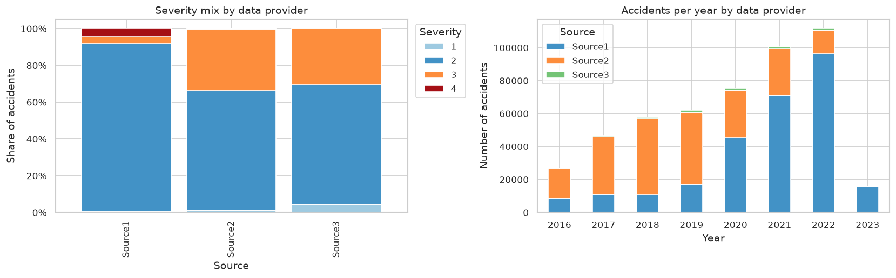

# US Accidents Severity Prediction

Can we predict how much a traffic accident will slow down traffic, using only what is known **at the moment it is reported**?

This project prepares the [US Accidents (2016–2023)](https://www.kaggle.com/datasets/sobhanmoosavi/us-accidents) dataset to predict accident **Severity** (1 = short delay, 4 = long delay) from time, location, weather and road features. It follows CRISP-DM from business understanding to feature engineering. Model training is the next stage.

> Severity measures the **impact on traffic (delay)**, not injuries.

📄 **Full report:** [`reports/midterm_report.pdf`](reports/midterm_report.pdf)

---

## Key findings

| | Finding |
|---|---|
| ⚖️ **Imbalance** | 80% of accidents are Severity 2 and only 2.6% are Severity 4, so models are judged with **macro F1**, not accuracy. |
| 🚫 **Leakage** | 88.5% of Severity 4 descriptions say "closed". End time, distance and description reveal the answer, so they were removed. |
| 🏢 **Data provider bias** | The strongest link with Severity (Cramér's V = 0.29): Source2 labels 34% of its accidents as Severity 3, Source1 only 4%. |
| 🛣️ **Road type** | Highway accidents are high-impact (Severity 3–4) **2.5×** more often than others (28% vs 11%). |
| 🌙 **Time** | Rush hour brings more accidents, but not worse ones. Severity 4 peaks around midnight (5–6% vs 1.6% at 7–8 h). |
| 🌧️ **Weather** | The effect is real but small: 22% of accidents in rain or storms are high-impact, against 17% in clear weather. |

<p align="center">
  
</p>

## Pipeline

| Phase | What happens | Notebook / code | Output |
|---|---|---|---|
| Data understanding | Load the 500K sample and check it matches the full 7.7M dataset | [`01_load_and_sample`](notebooks/01_load_and_sample.ipynb) | `data/sample.parquet` |
| Pre-processing | Leakage audit (11 columns removed), types, duplicates, missing values, outliers, category clean-up | [`02_cleaning`](notebooks/02_cleaning.ipynb) | `data/clean.parquet`, [leakage audit](reports/leakage_audit.md), [cleaning log](reports/cleaning_log.md) |
| EDA | 12 labelled charts, descriptive statistics, correlations, 6 hypothesis tests (chi-square, Kruskal-Wallis) with effect sizes | [`03_eda`](notebooks/03_eda.ipynb) | [`reports/figures/`](reports/figures) |
| Feature engineering | 41 candidate features → 36 selected; encoding and scaling fitted on the training split only | [`04_features`](notebooks/04_features.ipynb), [`src/features.py`](src/features.py) | `data/features.parquet`, [data dictionary](reports/data_dictionary.md) |

**Data size:** 500,000 × 46 raw → 495,532 × 36 clean → 495,532 × 37 features (36 inputs + target) → 165 model columns after encoding.

## Repository structure

```
├── US_Accidents_March23_sampled_500k.csv   # raw data: 500K-row sample (Git LFS)
├── notebooks/                              # 01 → 04, run in this order
├── src/features.py                         # feature creation + leakage-safe preprocessor
├── reports/
│   ├── midterm_report.pdf                  # written report
│   ├── figures/                            # all charts
│   ├── leakage_audit.md, cleaning_log.md, data_dictionary.md
├── run_all.py                              # runs every notebook top to bottom
├── requirements.txt
├── US_Accidents_Project_Plan.pdf           # original project plan
└── exec.ipynb                              # initial data exploration
```

`data/` is not versioned. The notebooks recreate it.

## Getting started

Requires **Python 3.10+** (Linux, macOS, WSL or Google Colab).

```bash
git clone https://github.com/rayenchanchah01/US_accidents.git
cd US_accidents
git lfs pull                       # downloads the 188 MB data file
python -m venv .venv
source .venv/bin/activate          # Windows: .venv\Scripts\activate
pip install -r requirements.txt
python run_all.py                  # runs notebooks 01 → 04 (~1 min)
```

You can also open the notebooks in Jupyter or VS Code and run them in order. All paths are relative, so nothing needs editing. A fixed random seed (`42`) makes every result reproducible.

<details>
<summary><b>Windows: "DLL load failed … application control policy"</b></summary>

On PCs with *Smart App Control* turned on, Windows blocks scikit-learn's compiled files. Notebooks 01–03 still run, but notebook 04 needs scikit-learn. Run the project in WSL (Ubuntu) instead:

```bash
sudo apt install python3-venv python3-pip
```

Then follow the steps above inside WSL.
</details>

## Method highlights

- **No leakage:**
  - A column is kept only if it is known when the accident is reported.
  - Imputation, encoding, clustering, scaling and feature selection are all fitted on the training split only.
  - A check confirms that cities never seen in training get frequency 0.
- **Statistics beyond p-values:** with about 500K rows nearly everything is "significant", so every test reports an effect size and is repeated on a 5,000-row sample.
- **Feature selection with explicit rules:**
  - Near-constant flags are removed (1 in fewer than 0.1% of rows).
  - For near-duplicate columns (|r| > 0.85), the one with less mutual information is removed.
- **Encodings:**

  | Columns | Encoding |
  |---|---|
  | Categories (State, Source, weather, wind, season) | One-hot |
  | City, County (thousands of values) | Frequency encoding |
  | Latitude / longitude | 50 K-means location clusters |

## Next steps

- **Train / validation / test:** a 70/15/15 split, plus a time-based check (train on 2016–2021, test on 2022–2023).
- **Models:** a dummy baseline, then Logistic Regression, Decision Tree, Random Forest and LightGBM / XGBoost, all using class weights.
- **Evaluation:** macro F1, recall on Severity 4, balanced accuracy and a confusion matrix.
- **Provider check:** train the best model with and without `Source`.
- **Explanation:** SHAP values.

## Team

Omar Tentouch · Tamjid Trabelsi · Youssef Ouenniche · Rayen Chanchah · Mohamed Yamoun

## Data and references

The dataset is used under the **CC BY-NC-SA 4.0** licence.

1. Moosavi, S., Samavatian, M. H., Parthasarathy, S., & Ramnath, R. (2019). *A Countrywide Traffic Accident Dataset.* arXiv:1906.05409.
2. Moosavi, S., Samavatian, M. H., Parthasarathy, S., Teodorescu, R., & Ramnath, R. (2019). *Accident Risk Prediction based on Heterogeneous Sparse Data: New Dataset and Insights.* ACM SIGSPATIAL 2019.
3. Moosavi, S. *US Accidents (2016–2023)* [Dataset]. Kaggle. https://www.kaggle.com/datasets/sobhanmoosavi/us-accidents
4. Moosavi, S. *US-Accidents: A Countrywide Traffic Accident Dataset.* https://smoosavi.org/datasets/us_accidents
